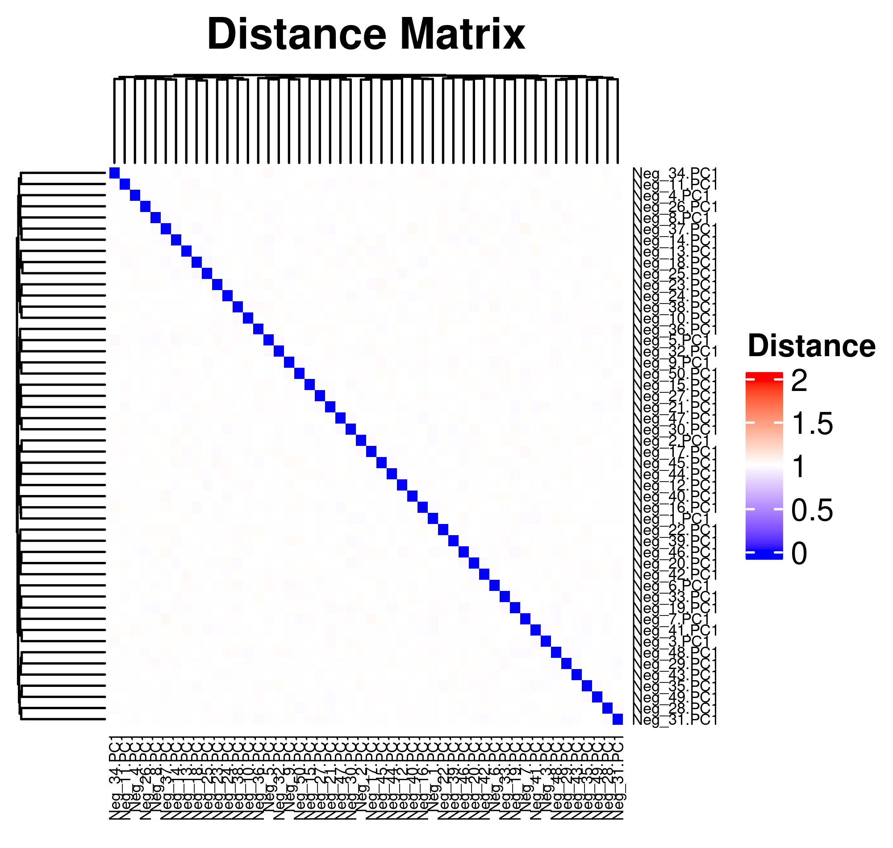

```{r setup, include=FALSE}
knitr::opts_chunk$set(echo = TRUE, collapse = TRUE)
```

```{r echo=FALSE, eval=TRUE}
suppressPackageStartupMessages({
  library(dplyr)
  library(ggplot2)
})
```

# Preparae negative controls
## Build negative controls
We used the negative-control dataset to explore the optimum number of clusters 
for hierarchical clustering. Negative-control dataset was built using the below
script.

```{r eval=FALSE}
## Do not run this script without checking it first!!
source("neg_controls.R")
```

This script runs the following processes:    

1. Generate 50 synthetic datasets:   
--> Each dataset contains 50 random samples from 44,890 samples (with replacement).   
--> Scramble genes in each dataset by random selection without replacement and
   add random value between -0.1 and 0.1   
   
2. Row-normalize synthetic datasets   

3. PCA on synthetic datasets    
--> saved as `bootstrap_PCs_rowNorm_Neg.rds`   

4. Combine top 20 PCs from traning datasets and PC1s from synthetic datasets    
--> saved as `all_{#neg}.rds`   

5. Calculate distance matrix and hcut for each combined dataset    
--> saved as `res_dist_{#neg}.rds` and `res_hclust_{#neg}.rds`   

6. Evaluate how the negative controls were separated    
--> saved as `evals_{#neg}.rds` and `eval_summary_{#neg}.rds`   


## Validate negative controls
Below is the summary of the distance matrix of 10,720 PCs (top 20 PCs from 
536 studies). 

```{r echo=FALSE}
dat_dir <- "~/GSS/GenomicSuperSignatureLibrary/refinebioRseq/Neg_Controls"
```

```{r collapse=FALSE, echo=FALSE, eval=TRUE}
wd <- "~/GSS/GenomicSuperSignatureLibrary/refinebioRseq/RAVmodel_536"
res_dist <- readRDS(file.path(wd, "res_dist.rds"))
# summary(res_dist)
#    Min. 1st Qu.  Median    Mean 3rd Qu.    Max.
# 0.01688 0.98783 1.00000 0.99999 1.01217 1.97482
```

```{r eval=TRUE}
summary(res_dist)
```

We create a synthetic dataset whose distance ranges median or higher of the 
actual 536 training dataset. Below is the distance matrix of the 50 negative 
controls generated from the `neg_controls.R` script. Distance ranges roughly 
between 1st and 3rd quarters of training dataset's distance distribution.

```{r collapse=FALSE, echo=FALSE, eval=TRUE}
neg <- readRDS(file.path(dat_dir, "bootstrap_PCs_rowNorm_Neg.rds"))
data <- lapply(neg, function(x) x$rotation) %>% Reduce(cbind,.) %>% t

ind <- c()
for (i in 1:50) {new_ind = c(1) + 20*(i-1); ind = c(ind, new_ind)} # only PC1s
control_dat <- data[ind,]

res.dist.neg <- factoextra::get_dist(control_dat, method = "spearman")
# summary(res.dist.neg)
#    Min. 1st Qu.  Median    Mean 3rd Qu.    Max. 
#  0.9680  0.9937  1.0000  0.9999  1.0054  1.0317 
```

```{r eval=TRUE}
summary(res.dist.neg)
```

We plot the heatmap of distance matrix using the different number of negative 
controls (PC1s from synthetic datasets). They are different within the range we 
want to separate.

```{r echo=FALSE}
neg <- readRDS(file.path(dat_dir, "bootstrap_PCs_rowNorm_Neg.rds"))
data <- lapply(neg, function(x) x$rotation) %>% Reduce(cbind,.) %>% t

dist_med <- 1.00000
dist_max <- 1.97482

numOfDatasets <- c(10, 20, 30, 40, 50)
numOfTopPCs <- 20

for (numOfDataset in numOfDatasets) {
  ind <- c()
  for (i in 1:numOfDataset) {new_ind = c(1) + numOfTopPCs*(i-1); ind = c(ind, new_ind)}
  control_dat <- data[ind,]

  res.dist.neg <- factoextra::get_dist(control_dat, method = "spearman")
  plot <- ComplexHeatmap::Heatmap(as.matrix(res.dist.neg),
                                  row_names_gp = grid::gpar(fontsize = 5),
                                  column_names_gp = grid::gpar(fontsize = 5),
                                  column_title = "Distance Method = spearman",
                                  column_title_side = "top",
                                  col = circlize::colorRamp2(breaks = c(0, dist_med, dist_max), 
                                                  colors = c("blue", "white", "red")))
  print(plot)
}
```

```{r save_heatmap50, echo=FALSE}
plot <- ComplexHeatmap::Heatmap(as.matrix(res.dist.neg),
                                row_names_gp = grid::gpar(fontsize = 5),
                                column_names_gp = grid::gpar(fontsize = 5),
                                column_title = "Distance Matrix",
                                column_title_side = "top",
                                column_title_gp = grid::gpar(fontsize = 14, fontface = "bold"),
                                col = circlize::colorRamp2(breaks = c(0, dist_med, dist_max), 
                                                colors = c("blue", "white", "red")),
                                heatmap_legend_param = list(title = "Distance"))

png("outputs/png/A.heatmap_neg50.png", res = 500, width = 4, height = 3.8, units = "in")
plot
dev.off()
```

```{r echo=FALSE, eval=TRUE, out.width="60%", out.height="50%"}

```


# Optimum number of clusters
Next we combined top 20 PCs of training datasets and PC1s from the varying 
numbers of negative controls (10, 20, 30, 40, and 50) and performed 
hierarchical clustering with the different numbers of clusters. Number of 
clusters was the rounds of the number of PCs divided by 9 different numbers 
(**d** = 7, 6, 5, 4, 3, 2.75, 2.5, 2.25, and 2).

```{r echo=FALSE}
numOfDatasets <- c(10, 20, 30, 40, 50)

## Load all eval_summary
eval_res <- list()
for (i in numOfDatasets) {
  fname <- paste0("eval_summary_", i)
  res <- readRDS(file.path(dat_dir, paste0(fname, ".rds"))) %>% as.data.frame 
  eval_res[[fname]] <- res
}

## Combine all eval_summary
df <- Reduce(rbind, eval_res) 
df$numOfControls <- rep(numOfDatasets, each = 9) %>% as.character   # length(k_range) = 9
df$separtedPortion <- as.numeric(df$numSeparated)/as.numeric(df$numOfControls)
df$numUnseparated <- as.numeric(df$numOfControls) - as.numeric(df$numSeparated)
```

### Proportion of the separated
This plot shows the proportion of the negative controls that are separated 
with the different numbers of clusters. For all five different numbers of 
negative controls, more than 90% of them were separated when **d = 4** and 
100% of them were separated when **d = 2.25**.

```{r plot1, echo=FALSE}
plot1 <- ggplot(df, aes(x = numOfCluster, y = separtedPortion)) + 
  geom_line(aes(colour = numOfControls)) + 
  geom_point() + 
  ggtitle("Proportion of separated negative controls") + 
  theme(plot.title = element_text(size = 14, face = "bold"))

plot1

## Save plot1
png("outputs/png/B.separatedPortion.png", res = 500, width = 5, height = 3.5, units = "in")
plot1
dev.off()
```

```{r echo=FALSE, eval=TRUE, out.width="75%", out.height="45%"}
knitr::include_graphics("outputs/png/B.separatedPortion.png")
```

### Number of the non-separated
This plot shows the actual number of negative controls that weren't separated 
with the different numbers of clusters.

```{r plot2, echo=FALSE}
df$numUnseparated <- as.numeric(df$numOfControls) - as.numeric(df$numSeparated)
plot2 <- ggplot(df, aes(x = numOfCluster, y = numUnseparated)) + 
  geom_line(aes(colour = numOfControls)) + 
  geom_point() + 
  ggtitle("Number of non-separated negative controls") + 
  theme(plot.title = element_text(size = 14, face = "bold"))

plot2

## Save plot2
png("outputs/png/C.numUnseparated.png", res = 500, width = 5, height = 3.5, units = "in")
plot2
dev.off()
```

```{r echo=FALSE, eval=TRUE, out.width="75%", out.height="45%"}
knitr::include_graphics("outputs/png/C.numUnseparated.png")
```

```{r sup_fig_3, echo=FALSE, eval=FALSE, out.width="180%", out.height="45%"}
## Capture ComplexHeatmap output as a glob object
gb <- grid::grid.grabExpr(ComplexHeatmap::draw(plot))

## Save Supplementary Figure 3
png("outputs/png/Sup_Fig_3.png", width = 1800, height = 450)
plot_all <- ggpubr::ggarrange(gb, plot1, plot2, 
                              widths = c(0.8, 1, 1),
                              ncol = 3)
plot_all
dev.off()
```

# Session Info

<details>
```{r}
sessionInfo()
```
</details>
