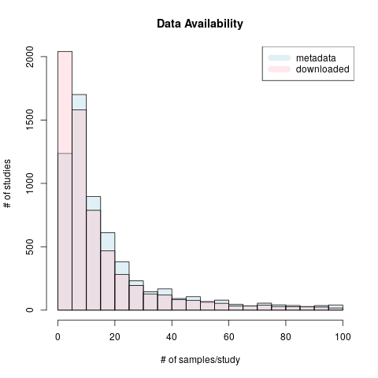

```{r setup, include = FALSE}
knitr::opts_chunk$set(
  comment = "#>", collapse = TRUE, message = FALSE, warning = FALSE 
)
```

```{r, echo=FALSE, results="hide", warning=FALSE, eval=FALSE}
if (!"pathwork" %in% installed.packages())
    devtools::install_github("thomasp85/patchwork")

suppressPackageStartupMessages({
  library(patchwork)
  library(pdftools)
})
```


```{r available_samples, echo=FALSE, eval=FALSE}

```


# Benchmark CRC paper
## CRC_top10_validated_ind.tsv
A data frame of top 10 validated indexes from 18 CRC datasets. This table was 
created in `CRC/repeat_Fig4A.Rmd`

```{r}
x <- read.table("CRC/outputs/CRC_top10_validated_ind.tsv")
head(x)
```

## CRC subtyping
Scatter plots showing how different signatures perform with CRC subtyping. 
These plots were created in `CRC/repeat_Fig4A.Rmd`

```{r fig.width=6, fig.height=5.5}
all <- list.files("CRC/outputs")
scatterplots <- all[grep("scatter_", all)]

for (plot in scatterplots) {
  x <- readRDS(file.path("CRC/outputs", plot))
  print(x)
}
```

## CRC binary clinical variables
Bar plots comparing different models in differentiating CRC binary clinical variables. 
These plots were created in `CRC/repeat_Fig4C.Rmd`

```{r fig.width=5, fig.height=3.5}
all <- list.files("CRC/outputs")
barplots <- all[grep("boxplot_", all)]

for (plot in barplots) {
  x <- readRDS(file.path("CRC/outputs", plot))
  print(x$value)
}
```


# Benchmark multiPLIER 
## sle_neutrophil.rds
Two scatter plots of PCcluster1551 x Neutrophil count/estimate of SLE-WB dataset. 
This plot was created in `SLE-WB/repeat_Fig3_SLE-WB.Rmd`

```{r fig.width=4, fig.height=4}
x <- readRDS("SLE-WB/sle_neutrophil.rds")
x
```

## nares_neutrophil.rds
A scatter plot of PCcluster1551 x Neutrophil estimate of NARES dataset. This plot
was created in `NARES/repeat_Fig3_NARES.Rmd`

```{r fig.width=4, fig.height=4}
x <- readRDS("NARES/nares_neutrophil.rds")
x
```

